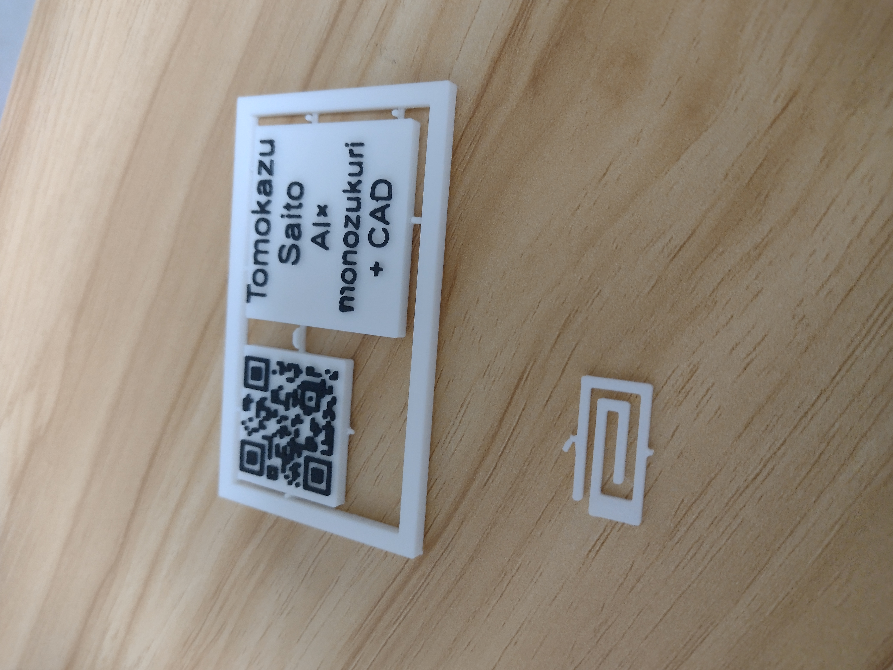
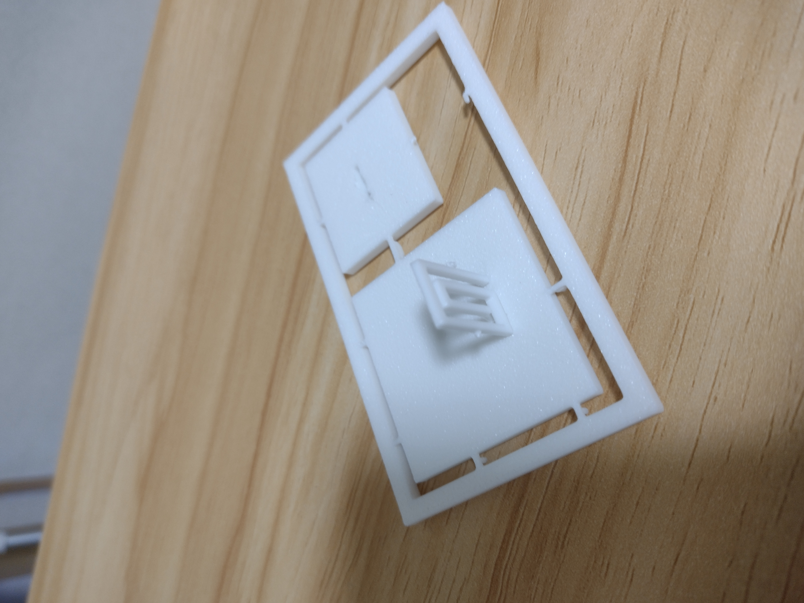

# 🎯 QRコード名刺プロジェクト

## 📱 プロジェクト概要
3Dプリンター(Neptune 4 Pro)で作成した革新的なQRコード名刺。プラモデル風のライナーで取り外し可能な設計により、書類クリップ付きの写真立てとしても活用できる多機能名刺です。

## 🎨 デザインコンセプト
- **モジュラー設計**: QRコードプレートとメッセージプレートが独立して取り外し可能
- **多機能性**: 名刺としての機能 + 写真立てとしての機能
- **実用性**: 書類クリップ付きで机の上に自立可能
- **技術的アピール**: 3Dプリンター技術とデザイン思考の融合

## 📐 技術仕様
### 基本サイズ
- **全体サイズ**: 60mm × 60mm × 2.0mm
- **QRコード部分**: 50mm × 50mm
- **材料**: 白PLA(ベース) + 黒PLA(QRコード)

### 構造設計
- **ライナーシステム**: プラモデル風の取り外し可能な接続部
- **自立機能**: 裏面の四角いへこみにクリップを差し込み写真立てとして使用
- **書類クリップ**: 机の上での安定性を確保

## 🖼️ プロジェクト写真

### メイン製品写真

*QRコード名刺の全体像 - プラモデル風ランナー設計により取り外し可能なモジュラー構造*

> ✨ **特徴**: 左側のQRコードプレートと右側のメッセージプレートが独立して取り外し可能。AIx、monozukuri、CADの技術スタックを明記。

### 詳細構造

*ライナーシステムの詳細 - プラモデル風の接続部（失敗例：QRコードが凹んで読み取り不可）*

### 自立機能

*写真立てとしての自立機能 - 裏面のへこみとクリップシステム*

### QRコード部分

*QRコードの精密な印刷 - 黒PLAによる高コントラスト*

### メッセージプレート

*メッセージプレートのデザイン - カスタマイズ可能な情報表示*

### 使用例

*机の上での使用例 - 書類クリップによる安定性*


*写真立てとしての活用 - 多機能性の実証*

### 技術的詳細

*3Dプリント技術の精密さ - 層積造形の美しさ*


*材料の組み合わせ - 白PLAと黒PLAの効果的な使用*

### 開発過程

*設計段階のスクリーンショット - 3Dモデリングの過程*


*最終調整段階 - 品質管理とテスト*

## 🚀 実装手順
1. ✅ **QRコード生成** (完了)
   - GitHubポートフォリオへの直接リンク
   - URL: https://github.com/tomomo086

2. ✅ **3Dモデリング** (完了)
   - モジュラー設計の実装
   - ライナーシステムの設計
   - 自立機能の組み込み

3. ✅ **マルチカラー印刷設定** (完了)
   - 白PLAベース + 黒PLA QRコード
   - 精密な層積造形

4. ✅ **面談準備** (完了)
   - 実物サンプルの完成
   - デモンストレーション準備

## 🔧 技術的課題と解決策
### 初期の失敗例
- **問題**: QRコードを凹ませてしまい読み取り不可
- **原因**: 印刷設定の調整不足
- **解決**: 適切な層高と印刷速度の調整により改善

### 品質管理のポイント
- **QRコードの読み取りテスト**: 各試作品で必ずスキャンテスト実施
- **印刷精度**: 0.1mm以下の層高で精密な造形
- **材料選択**: コントラストの高い白PLA + 黒PLAの組み合わせ

## 🎯 プロジェクトの価値
### 技術的アピール
- **3Dプリンター技術**: 精密な造形技術の実証
- **デザイン思考**: 実用性と美しさの両立
- **モジュラー設計**: 拡張性と保守性の考慮
- **問題解決能力**: 失敗から学び、改善を重ねる姿勢

### ビジネス価値
- **差別化**: 従来の名刺にはない革新的な機能
- **記憶に残る**: 面談での強烈な印象
- **多機能性**: 名刺 + 写真立ての二重価値

### 実用性
- **情報共有**: QRコードによる効率的な情報伝達
- **空間活用**: 机の上での実用的な配置
- **カスタマイズ**: メッセージプレートの変更可能

## 📂 プロジェクト構成
```
QR_Business_Card/
├── 3d_models/          # 3Dモデルファイル
│   └── qr_card_with_dino.blend
├── photos/             # プロジェクト写真
│   ├── 1.jpg - 9.jpg   # 製品写真
│   └── screenshot*.png # 開発過程
├── print_settings/     # 印刷設定・G-code
├── LICENSE            # ライセンス情報
└── README.md          # プロジェクト説明
```

## 🔧 技術スタック
- **3Dモデリング**: Blender
- **3Dプリンター**: Neptune 4 Pro
- **材料**: PLA (白・黒)
- **設計思想**: モジュラー設計、ユーザビリティ重視

## 🎉 成果
面談での圧倒的差別化を実現！技術力と創意工夫を効果的にアピールできる実用的なツールとして完成。

---
**作成日**: 2025-07-21  
**最終更新**: 2025-07-27  
**対象機種**: Neptune 4 Pro  
**プロジェクト状態**: 完了 ✅
