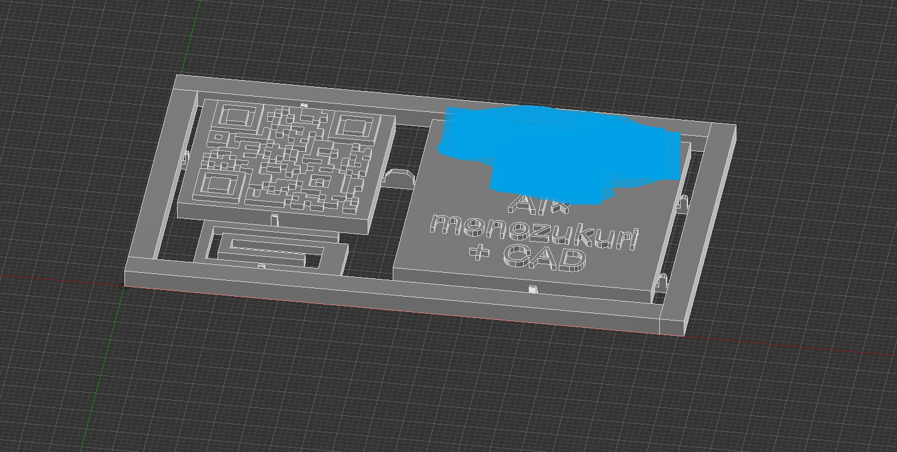

# 🎯 QRコード名刺プロジェクト

## 📱 プロジェクト概要
3Dプリンター(Neptune 4 Pro)を使って作ったQRコード名刺です。プラモデル風の取り外し可能な設計で、名刺として使った後は机の上に立ててQRコードを読みやすくできる多機能な作品です。裏面の四角い凹みに書類クリップを差し込むことで自立機能を実現し、さらに書類や写真を挟んで整理することも可能です。QRコードでGitHubポートフォリオに直接アクセスでき、技術的なアピールと実用性を両立させました。

## ⭐ 技術的アピールポイント

### 🔗 **デジタル統合技術**
- **QRコード実装**: 自前でQRコードを生成し、GitHubポートフォリオへの直接リンクを実装
- **効率化設計**: 従来の手入力プロセスを排除し、瞬時の情報共有を実現
- **技術的差別化**: デジタル時代に対応した先進的なソリューション

### 🧩 **モジュラー設計思想**
- **拡張性重視**: プラモデル風ライナーシステムによる取り外し可能なモジュラー設計
- **保守性向上**: 各コンポーネントの独立した交換・カスタマイズが可能
- **スケーラビリティ**: 新しい機能プレートの追加による機能拡張が容易

### 📸 **ユーザビリティ設計**
- **ライフサイクル設計**: 名刺としての使用後も机の上に立ててQRコードを読みやすくする継続的な価値を提供
- **実用性重視**: 自立機能とクリップシステムによる実用的な空間活用
- **ユーザー体験**: 単なる名刺を超えた多機能ツールとしての価値創造

### 🎨 **製造技術の実証**
- **3Dプリンター技術**: Neptune 4 Proを使用した精密な層積造形技術の実装
- **マルチマテリアル印刷**: 白PLAと黒PLAの効果的な組み合わせによる高コントラスト実現
- **品質管理**: 0.1mm以下の層高による精密な造形とQRコード読み取り精度の確保

## 🎨 デザインコンセプト
- **モジュラー設計**: QRコードプレートとメッセージプレートが独立して取り外し可能
- **多機能性**: 名刺としての機能 + 机の上に立ててQRコードを読みやすくする機能
- **実用性**: 書類クリップ付きで机の上に自立可能
- **技術的アピール**: 3Dプリンター技術とデザイン思考の融合

## 📐 技術仕様
### 基本サイズ
- **全体サイズ**: 60mm × 60mm × 2.0mm
- **QRコード部分**: 50mm × 50mm
- **QRコード詳細サイズ**: 29mm × 29mm（QRコード内部構造）
- **クリップ差込用凹み**: 91mm × 55mm
- **材料**: 白PLA(ベース) + 黒PLA(QRコード)

### 構造設計
- **ライナーシステム**: プラモデル風の取り外し可能な接続部
- **自立機能**: 裏面の四角いへこみにクリップを差し込み机の上に立ててQRコードを読みやすくする
- **書類クリップ**: 机の上での安定性を確保

## 🖼️ プロジェクト写真

### メイン製品写真

*QRコード名刺の全体像 - プラモデル風ランナー設計により取り外し可能なモジュラー構造*

> ✨ **特徴**: 左側のQRコードプレートと右側のメッセージプレートが独立して取り外し可能。AIx、monozukuri、CADの技術スタックを明記。

### クリップ差込用凹み

*クリップ差込用凹みの精密加工 - クリアランス0.2mmでちょうどよいフィット感を実現*

### 自立機能

*自立機能 - 机の上に立ててQRコードを読みやすくする*

### 使用例

*クリップで写真を挟んだ使用例 - 多機能性の実証*


*自立機能の実証 - 机の上で安定して立つ機能*

### 技術的詳細

*QRコード部分も立つ*


*失敗例：QRコードが凹んで読み取り不可、もっと影とのコントラストをつければ読みとれたかもしれない*

### 開発過程

*表*


*裏*

## 🚀 実装手順
1. ✅ **QRコード生成** (完了)
   - GitHubポートフォリオへの直接リンク
   - URL: https://github.com/tomomo086

2. ✅ **3Dモデリング** (完了)
   - モジュラー設計の実装
   - ライナーシステムの設計
   - 自立機能の組み込み

3. ✅ **マルチカラー印刷設定** (完了)
   - 白PLAベース + 黒PLA QRコード
   - 精密な層積造形

4. ✅ **面談準備** (完了)
   - 実物サンプルの完成
   - デモンストレーション準備

## 🔧 技術的課題と解決策
### 初期の失敗例
- **問題**: QRコードを凹ませてしまい読み取り不可
- **原因**: 印刷設定の調整不足
- **解決**: 適切な層高と印刷速度の調整により改善

### 品質管理のポイント
- **QRコードの読み取りテスト**: 各試作品で必ずスキャンテスト実施
- **印刷精度**: 0.1mm以下の層高で精密な造形
- **材料選択**: コントラストの高い白PLA + 黒PLAの組み合わせ

## 🎯 プロジェクトの価値
### 技術的アピール
- **3Dプリンター技術**: 精密な造形技術の実証
- **デザイン思考**: 実用性と美しさの両立
- **モジュラー設計**: 拡張性と保守性の考慮
- **問題解決能力**: 失敗から学び、改善を重ねる姿勢

### ビジネス価値
- **差別化**: 従来の名刺にはない革新的な機能
- **記憶に残る**: 面談での強烈な印象
- **多機能性**: 名刺 + 机の上に立ててQRコードを読みやすくする二重価値

### 実用性
- **情報共有**: QRコードによる効率的な情報伝達
- **空間活用**: 机の上での実用的な配置
- **カスタマイズ**: メッセージプレートの変更可能

## 📂 プロジェクト構成
```
QR_Business_Card/
├── photos/             # プロジェクト写真
│   ├── 1.jpg - 9.jpg   # 製品写真
│   └── screenshot1.png, screenshot2.png # 開発過程
├── .git/               # Gitリポジトリ
├── .gitattributes      # Git属性設定
├── LICENSE            # ライセンス情報
└── README.md          # プロジェクト説明
```

## 🔧 技術スタック
- **3Dモデリング**: Blender
- **3Dプリンター**: Neptune 4 Pro
- **材料**: PLA (白・黒)
- **設計思想**: モジュラー設計、ユーザビリティ重視

## 🎉 成果
面談での圧倒的差別化を実現！技術力と創意工夫を効果的にアピールできる実用的なツールとして完成。

---
**作成日**: 2025-07-21  
**最終更新**: 2025-07-27  
**対象機種**: Neptune 4 Pro  
**プロジェクト状態**: 完了 ✅

---

## 📋 開発情報

| **開発者** | tomomo086 + Claude4 |
| **開発期間** | 2025年7月 |
| **バージョン** | 1.0.0 |
| **開発ツール** | Claude4, ClaudeCode, Cursor |

---

## 🔗 関連リンク

- [tomomo086:Github](https://github.com/tomomo086)
- [@mirai_sousiyo39:X](https://x.com/mirai_sousiyo39)

---

**作成者**: [tomomo086(@mirai_sousiyo39) + Claude4]   
**最終更新**: 2025年7月26日

---

*このREADMEもClaude4、ClaudeCode、CursorによるAI支援で作成されています 🤖💻*
